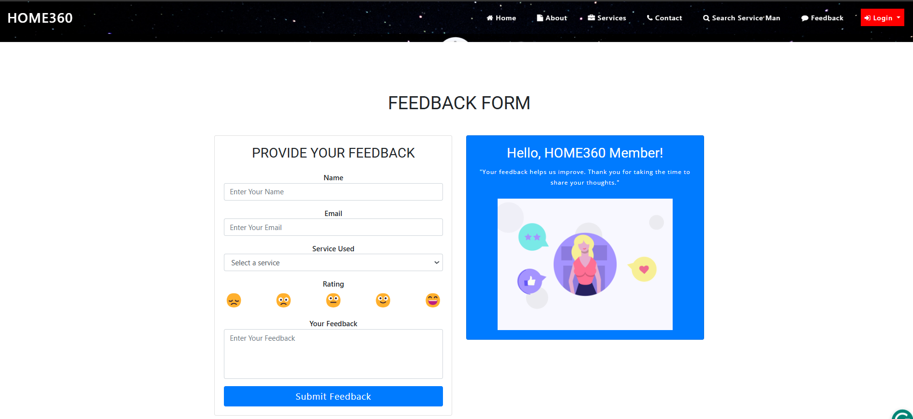

# 🏠 HOME360
A full-stack home services booking platform built with Django and React that connects homeowners with service providers. The platform features real-time scheduling, secure payment processing, and an intuitive service marketplace.

## ✨ Features
- **Real-time Booking System** 📅
  - Instant appointment scheduling and confirmation
  - Live availability updates for service providers
  - Automated provider matching based on service requirements

- **User Management** 👥
  - Multi-role system (Customers, Service Providers, Admins)
  - Personalized dashboards for each user type
  - Profile management and service history

- **Service Marketplace** 🛍️
  - Comprehensive listing of home services
  - Advanced search and filtering options
  - Provider ratings and reviews system

- **Payment Integration** 💳
  - Secure payment processing
  - Multiple payment method support
  - Automated billing and invoicing

- **Real-time Notifications** 🔔
  - WebSocket-powered instant updates
  - Booking confirmations and reminders
  - Service status notifications

## 🛠️ Tech Stack
### Backend 🔧
- Python
- Django
- Django REST Framework
- WebSockets
- PostgreSQL

### Frontend 🎨
- React.js
- WebSocket Client
- Material UI/Bootstrap
- Redux for state management

## 📊 Performance Highlights
- 60% reduction in page load times through optimization
- 95% positive user feedback during beta testing
- Scalable architecture supporting multiple concurrent users
- Real-time data synchronization

## ⚙️ Backend Setup
```bash
cd backend
pip install -r requirements.txt
python manage.py migrate
python manage.py runserver
```

## 🖥️ Frontend Setup
```bash
cd frontend
npm install
npm start
```

## 🔐 Environment Variables
Create a .env file in the backend directory:
```env
SECRET_KEY=your_secret_key
DEBUG=True
DATABASE_URL=your_database_url
PAYMENT_API_KEY=your_payment_api_key
```

## 👨‍💼 Admin Features
- Comprehensive dashboard with analytics
- Service provider management
- Booking oversight and conflict resolution
- Revenue tracking and reporting

## 🚀 Future Enhancements
- Mobile application development
- AI-powered provider matching
- Expanded payment options
- Service quality monitoring system

## ⏱️ Project Timeline
May 2024 - August 2024


## 📸 Application Screenshots

### Homepage
<div align="center">
  
  <p><em>Main landing page with available services and features</em></p>
</div>

### Service Listings
<div align="center">
  
  <p><em>Browse through various home services</em></p>
</div>

### Booking Interface
<div align="center">
  
  <p><em>Easy and intuitive booking system</em></p>
</div>

### User Feedback
<div align="center">
  
  <p><em>Customer feedback and rating system</em></p>
</div>

### Order Management
<div align="center">
  
  <p><em>Track and manage service orders</em></p>
</div>

### Admin Dashboard
<div align="center">
  
  <p><em>Administrative control panel</em></p>
</div>

### User Registration
<div align="center">
  
  <p><em>User registration interface</em></p>
</div>

## 🤝 Contributing
Pull requests are welcome. For major changes, please open an issue first to discuss what you would like to change.
